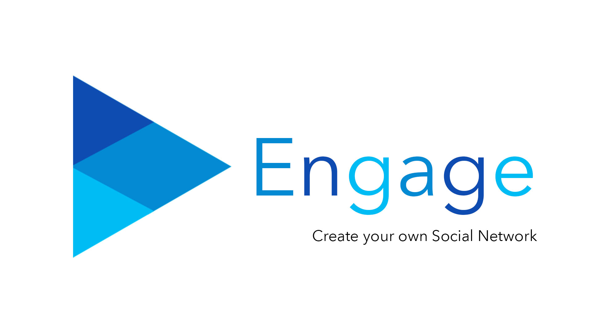

# 

# Engage

Create your own social network!

> Engage is currently an iOS exclusive app that allows you to create your own social networking space! Designed specifically to help clubs, organizations and student societies to improve the communication and organization. 

## Some of the core features include:
- Complete Customization: Make your group unique with a wide variety of customization options!
- Security: Make your group public or secure to prevent unwanted users!
- Privacy: Block or report inappropriate users, admins can remove them from a group
- Subgroups: A group within a group! Perfect for small teams that need to have their own space.
- Access Restrictions: Only assigned admins can edit your group or subgroups information!
- Messaging: Featuring private and group messaging to keep everyone in the loop!
- Calendar: Simplify planning with a builtin calendar and event tracking!

This app has been a personal project of mine and I thank you for your support!

## To-Do List

- [x] Release on App Store
- [ ] Create a marketing web page
- [ ] Start a Kickstarter to fund improvements and an Android version
- [ ] Enhance UI
- [ ] Enhance group messaging using the SlackTextViewController

## Team

### Nathan Tannar
### Computer Science Undergraduate Student at SFU
https://nathantannar.me

